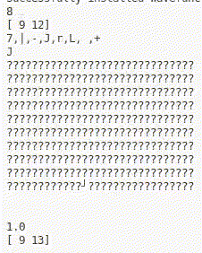

# Wave Function Collapse

- The idea is to provide a generic library, implemented in [`wfc.py`](src/wavefunctioncollapse/wfc.py), that the user has to provide with a tileset.
- Note that the implementation is not complete:
    - During execution there may be a case where no possible tiles can be found
- The algorithm is also not optimized for runtime

## How to run
Look at [`example_boxes.py`](src/wavefunctioncollapse/example_boxes.py) and [`example_paths.py`](src/wavefunctioncollapse/example_paths.py) for an example of how to use the algorithm.

## Demo
[`example_paths.py`](src/wavefunctioncollapse/example_paths.py) produces the following output:
